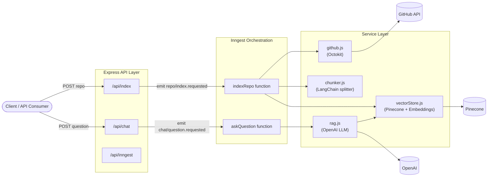
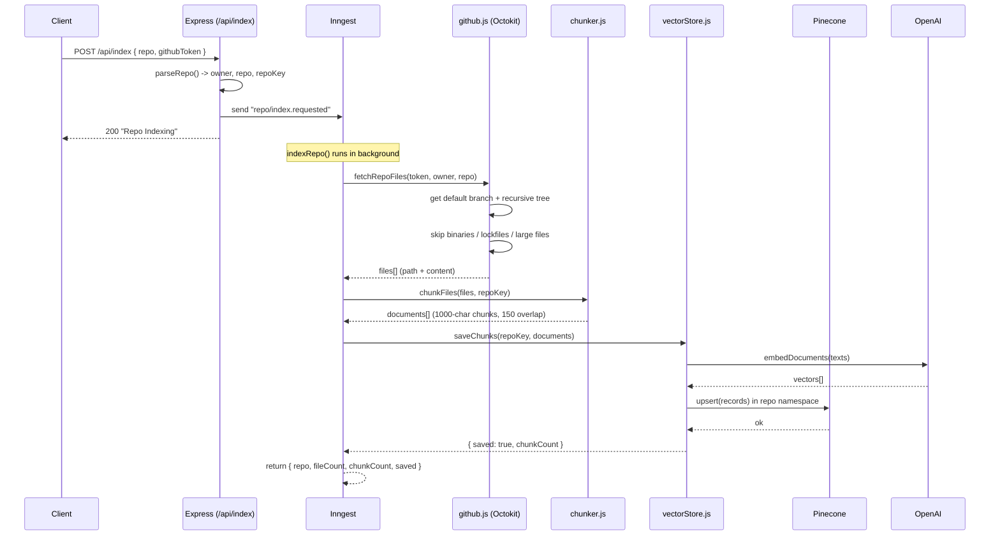
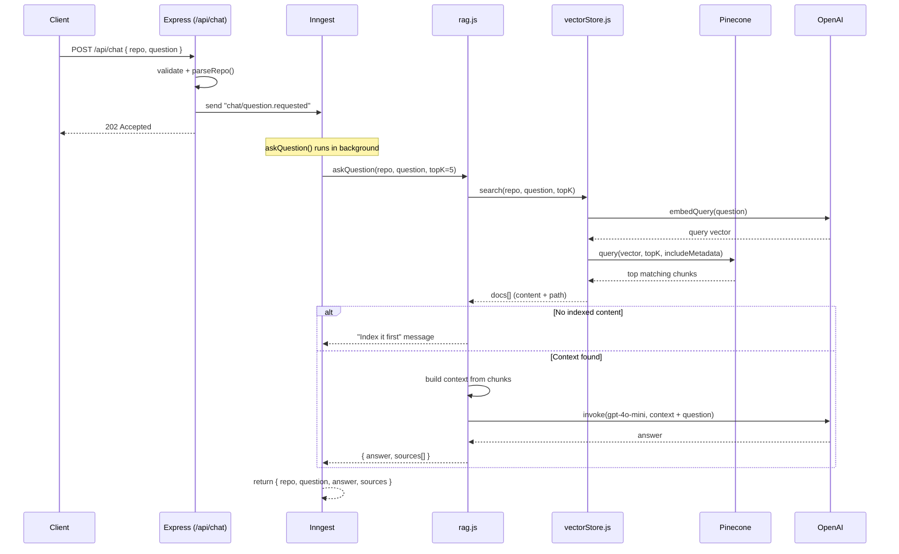

# RepoChat — Chat With Any GitHub Repository Using AI

> Point RepoChat at a GitHub repo, ask it questions in plain English, and get accurate, source-cited answers grounded in the actual code — powered by Retrieval-Augmented Generation (RAG).

RepoChat turns an entire codebase into a conversational knowledge base. Instead of manually digging through hundreds of files to understand how a project works, you index the repo once and then simply *ask*: "How does authentication work?", "Where is the database configured?", "What does the payment service do?" — and get an answer backed by the exact files it came from.

---

## Table of Contents

- [What Is RepoChat](#what-is-repochat)
- [What It Does](#what-it-does)
- [Key Highlights](#key-highlights)
- [Tech Stack](#tech-stack)
- [Dependencies](#dependencies)
- [Architecture Overview](#architecture-overview)
- [Feature 1 — Repository Indexing Flow](#feature-1--repository-indexing-flow)
- [Feature 2 — Chat / Question-Answering Flow](#feature-2--chat--question-answering-flow)
- [Project Structure](#project-structure)
- [Getting Started](#getting-started)
- [API Reference](#api-reference)
- [Environment Variables](#environment-variables)

---

## What Is RepoChat

RepoChat is a **Node.js backend service** that lets you have an intelligent conversation with any GitHub repository. It reads the code in a repo, breaks it into meaningful pieces, converts those pieces into mathematical representations (embeddings), stores them in a vector database, and then uses a Large Language Model (LLM) to answer questions using only the relevant code as context.

In short, it is a **RAG (Retrieval-Augmented Generation) pipeline for source code**, wrapped in a clean REST API and orchestrated with durable background jobs.

## What It Does

RepoChat exposes two core capabilities through simple HTTP endpoints:

1. **Index a repository** — Fetches all meaningful source files from a GitHub repo (skipping binaries, lockfiles, and build artifacts), splits them into overlapping chunks, generates embeddings, and stores them in a Pinecone vector index namespaced per repository.

2. **Ask questions about the repository** — Takes a natural-language question, finds the most semantically relevant code chunks from the indexed repo, and feeds them to an OpenAI model to produce an answer that is grounded in the code and cited back to the source files.

Both operations run as **asynchronous, durable background jobs** using Inngest, so long-running work (like fetching hundreds of files or generating embeddings) never blocks the API and can safely retry on failure.

## Key Highlights

- **Retrieval-Augmented Generation (RAG)** — answers are grounded in actual repository content, not the model's imagination.
- **Source citations** — every answer returns the list of files it was derived from.
- **Smart file filtering** — automatically skips `node_modules`, binaries, media, lockfiles, and oversized files to keep indexing fast and relevant.
- **Durable background processing** — powered by Inngest for automatic retries, step-level checkpointing, and observability.
- **Per-repository isolation** — each repo lives in its own Pinecone namespace, so multiple projects never mix context.
- **Deterministic de-duplication** — chunk IDs are content-hashed, so re-indexing the same repo won't create duplicates.

---

## Tech Stack

| Layer | Technology | Purpose |
| --- | --- | --- |
| **Runtime** | Node.js (ES Modules) | JavaScript server runtime |
| **Web Framework** | Express 5 | REST API and routing |
| **Background Jobs** | Inngest | Durable, event-driven, retryable workflows |
| **LLM & Embeddings** | OpenAI (`gpt-4o-mini`, `text-embedding-3-small`) | Answer generation and vectorization |
| **AI Orchestration** | LangChain | Text splitting, embeddings, and chat model abstractions |
| **Vector Database** | Pinecone | Storage and semantic search of code embeddings |
| **Source Integration** | GitHub REST API (Octokit) | Fetching repository file trees and contents |
| **Config** | dotenv | Environment variable management |

## Dependencies

From `package.json`:

| Package | Version | Role |
| --- | --- | --- |
| `express` | ^5.2.1 | HTTP server and routing |
| `inngest` | ^4.19.0 | Durable background job orchestration |
| `@langchain/core` | ^1.2.9 | Core LangChain primitives |
| `@langchain/openai` | ^1.5.11 | OpenAI chat model + embeddings integration |
| `@langchain/pinecone` | ^1.0.3 | Pinecone vector store integration for LangChain |
| `@langchain/textsplitters` | ^1.0.1 | Recursive character text splitting for chunking |
| `@pinecone-database/pinecone` | ^8.2.0 | Official Pinecone SDK |
| `@octokit/rest` | ^22.0.1 | GitHub REST API client |
| `dotenv` | ^17.4.2 | Loads environment variables from `.env` |

**Dev dependency:** `nodemon` (via the `dev` script) for hot-reloading during development.

---

## Architecture Overview

RepoChat is built around a clean separation between the **API layer** (Express routes), the **orchestration layer** (Inngest functions), and the **service layer** (GitHub, chunking, vector store, RAG).



The API endpoints do almost no heavy lifting themselves — they simply validate input and **emit an event**. Inngest picks up that event and runs the corresponding workflow in the background, step by step, with automatic retries.

---

## Feature 1 — Repository Indexing Flow

Indexing is how RepoChat "reads" a repository and stores it in a form that's searchable by meaning. You kick it off with a single POST request, and the rest happens asynchronously.

### Step-by-step

1. **Client sends a repo** to `POST /api/index` (a GitHub URL or `owner/repo` string, optionally with a GitHub token).
2. **The route parses the repo** into `{ owner, repo, repoKey }` and emits the `repo/index.requested` event — then immediately responds so the client isn't blocked.
3. **Inngest runs the `indexRepo` function** as a durable job with four checkpointed steps:
   - **Fetch files** — Octokit reads the repo's default-branch file tree recursively, downloads each blob, and skips anything irrelevant (binaries, media, lockfiles, `node_modules`, files > 200 KB, capped at ~200 files).
   - **Chunk files** — Each file's content is split into ~1000-character chunks with 150 characters of overlap, preserving `path` and `repo` metadata.
   - **Embed & save** — Chunks are converted to embeddings via OpenAI's `text-embedding-3-small` and upserted into Pinecone (batched, in a repo-specific namespace, with content-hashed IDs to avoid duplicates).
4. **The job returns a summary**: repo key, file count, chunk count, and save status.

### Indexing sequence diagram



---

## Feature 2 — Chat / Question-Answering Flow

Once a repo is indexed, you can ask it anything. RepoChat retrieves the most relevant code and uses an LLM to answer using only that context, so responses stay grounded and cite their sources.

### Step-by-step

1. **Client sends a question** to `POST /api/chat` with `{ repo, question }`.
2. **The route validates input**, parses the repo key, emits the `chat/question.requested` event, and responds immediately.
3. **Inngest runs the `askQuestion` function**, which calls the RAG service:
   - **Embed the question** using the same embedding model used for indexing.
   - **Semantic search** — query Pinecone in the repo's namespace for the top `K` (default 5) most similar chunks.
   - **Build context** — concatenate the retrieved chunks along with their file paths.
   - **Generate answer** — send the context plus the question to OpenAI `gpt-4o-mini` with an instruction to answer using the repo context only.
4. **The job returns** the answer plus a de-duplicated list of source file paths. If nothing is indexed for the repo, it returns a helpful "index it first" message.

### Chat sequence diagram



---

## Project Structure

```
RepoChat/
├── src/
│   ├── index.js                      # Express app entry point, mounts routes + Inngest
│   ├── inngest/
│   │   ├── client.js                 # Inngest client instance
│   │   ├── index.js                  # Registers all Inngest functions
│   │   └── functions/
│   │       ├── indexRepo.js          # Indexing workflow (fetch -> chunk -> save)
│   │       ├── askQuestion.js        # Q&A workflow (retrieve -> answer)
│   │       └── helloWorld.js         # Sample/test function
│   ├── routes/
│   │   ├── index.routes.js           # POST /api/index  (start indexing)
│   │   └── chat.routes.js            # POST /api/chat   (ask a question)
│   └── services/
│       ├── github.js                 # GitHub file fetching + repo parsing + filtering
│       ├── chunker.js                # Recursive text splitting into chunks
│       ├── vectorStore.js            # Embeddings + Pinecone upsert/search
│       └── rag.js                    # Retrieval + LLM answer generation
├── package.json
├── .env                              # Secrets (not committed)
└── README.md
```

---

## Getting Started

### Prerequisites

- **Node.js** (v18+ recommended for native ESM support)
- An **OpenAI API key**
- A **Pinecone account**, API key, and an index (default name: `repochat`)
- A **GitHub token** (a fine-grained token with read access to the repos you want to index)

### Installation

```bash
git clone https://github.com/SharmaAtul12/RepoChat.git
cd RepoChat
npm install
```

### Configuration

Create a `.env` file in the project root (see [Environment Variables](#environment-variables) below).

### Run

RepoChat needs two processes running side by side: the Express server and the Inngest dev server (which executes the background functions locally).

```bash
# Terminal 1 — start the API server (hot reload)
npm run dev

# Terminal 2 — start the Inngest dev server (executes background jobs)
npx inngest-cli@latest dev
```

The Inngest dev server auto-discovers your functions at `http://localhost:3000/api/inngest`. Open the Inngest dev dashboard (usually `http://localhost:8288`) to watch jobs run in real time.

---

## API Reference

### Health Check

```http
GET /health
```

Returns `Server is healthy`.

### Index a Repository

```http
POST /api/index
Content-Type: application/json

{
  "repo": "https://github.com/owner/repo",
  "githubToken": "optional_if_set_in_env"
}
```

Emits a `repo/index.requested` event and returns immediately. Track progress in the Inngest dashboard.

### Ask a Question

```http
POST /api/chat
Content-Type: application/json

{
  "repo": "owner/repo",
  "question": "How does authentication work in this project?"
}
```

Emits a `chat/question.requested` event and returns `202 Accepted`. The answer and its source files appear in the Inngest run output.

> Note: Both endpoints are event-driven and return before the work completes. Results (answers, indexing summaries) are available through the Inngest run output/dashboard.

---

## Environment Variables

| Variable | Required | Description |
| --- | --- | --- |
| `OPENAI_API_KEY` | Yes | Used for embeddings and chat completions. |
| `PINECONE_API_KEY` | Yes | Authenticates with your Pinecone project. |
| `PINECONE_INDEX` | No | Pinecone index name. Defaults to `repochat`. |
| `GITHUB_TOKEN` | Optional | Default GitHub token if not provided per request. |

Example `.env`:

```env
OPENAI_API_KEY=sk-...
PINECONE_API_KEY=pcsk_...
PINECONE_INDEX=repochat
GITHUB_TOKEN=github_pat_...
```

---

## How RAG Makes Answers Accurate

Traditional LLMs "hallucinate" because they answer from memory. RepoChat avoids this by **retrieving real code first** and instructing the model to answer *only* from that retrieved context. This means:

- Answers reflect the **actual current code** in the repo, not stale training data.
- Every answer is **traceable** to specific files (returned as `sources`).
- Unindexed repos are handled gracefully with a clear prompt to index first.

---

*Built with Node.js, Express, Inngest, LangChain, OpenAI, and Pinecone.*
